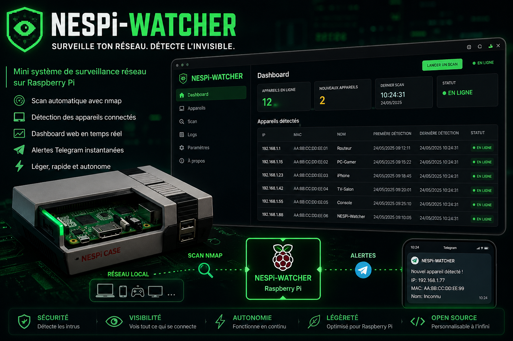
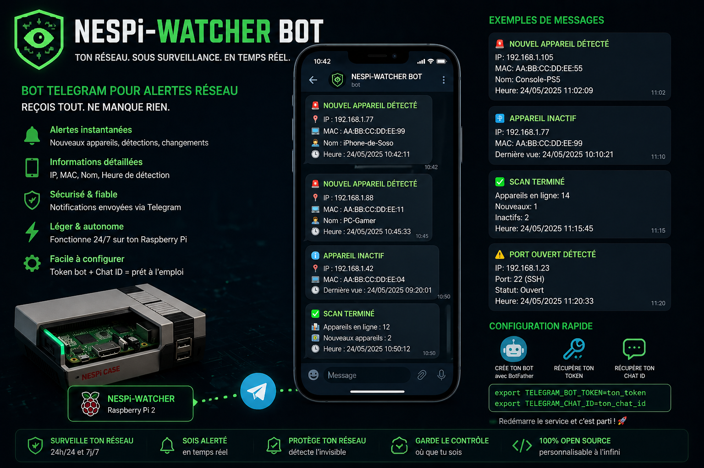

# NESPi Watcher

NESPi Watcher est un dashboard web local de surveillance réseau, optimisé pour Raspberry Pi (léger, sans dépendances lourdes).

## Présentation

### Vue globale du projet



### Bot Telegram (alertes)



## Fonctionnalités principales

- Scan réseau local automatique et manuel (`nmap`)
- Support multi-réseaux (`NETWORK_RANGES`)
- Stockage SQLite (appareils, historique scans, événements)
- Dashboard web Flask local
- Détection nouveaux appareils + changements (hostname, IP)
- Alertes Telegram optionnelles
- Export JSON/CSV des appareils
- Endpoint health + metrics
- Scripts d’installation, mise à jour, backup

## Installation (Raspberry)

```bash
git clone <URL_DU_REPO_GIT> <DOSSIER_LOCAL>
cd <DOSSIER_LOCAL>
chmod +x scripts/*.sh
./scripts/install.sh
```

## Mise à jour

```bash
cd <DOSSIER_LOCAL>
./scripts/update.sh
```

## Endpoints utiles

- `GET /` : dashboard
- `GET /health` : healthcheck
- `GET /metrics` : métriques texte
- `GET|POST /api/scan?profile=quick|deep`
- `GET /api/devices?limit=100&offset=0&search=&status=all|online|offline`
- `POST /api/device/meta`
- `GET /api/device/timeline?ip=<IP>&mac=<MAC>&limit=100`
- `GET /api/scans?limit=50`
- `GET /api/events?limit=50`
- `GET /api/status`
- `GET /api/export/devices?format=json|csv&token=<EXPORT_TOKEN>`

## Configuration `.env` (essentiel)

```env
NETWORK_RANGES=192.168.1.0/24
APP_HOST=0.0.0.0
APP_PORT=8080

SCAN_PROFILES=quick,deep
DEFAULT_SCAN_PROFILE=quick
SCAN_TIMEOUT=60
SCAN_INTERVAL_SECONDS=600

AUTO_SCAN_ENABLED=true
STARTUP_SCAN_ENABLED=false
OFFLINE_AFTER_SECONDS=1800

TELEGRAM_BOT_TOKEN=
TELEGRAM_CHAT_ID=
TELEGRAM_MODE=summary

SCAN_API_KEY=
EXPORT_TOKEN=

READ_ONLY_API=false
MAINTENANCE_MODE=false

LOG_LEVEL=INFO
```

## Options avancées (déjà supportées)

- Sécurité API : `SCAN_API_KEY`, `API_RATE_LIMIT_SCAN_PER_MIN`, `READ_ONLY_API`, `MAINTENANCE_MODE`
- Export : `EXPORT_TOKEN`, `EXPORT_MAX_ROWS`, `EXPORT_INCLUDE_NOTES`, `CSV_SEPARATOR`, `EXPORT_REDACT`
- Alertes : cooldown, quiet hours, webhook, seuils, ports sensibles
- Fiabilité : auto backup, purge rétention, WAL, vacuum, heartbeat
- UI/API : masquage IP/MAC, page size, refresh, timezone, thème

## Scripts

- `scripts/install.sh` : installation complète + service systemd
- `scripts/update.sh` : pull + dépendances + restart service
- `scripts/scan_once.sh` : scan manuel CLI
- `scripts/backup.sh` : backup SQLite compressé

## Dépannage

### 1. Service actif mais page en erreur

```bash
sudo journalctl -u nespi-watcher.service -n 120 --no-pager
```

### 2. Vérifier health local

```bash
curl -s http://127.0.0.1:8080/health
```

### 3. Vérifier status applicatif

```bash
curl -s http://127.0.0.1:8080/api/status
```

### 4. Redémarrer proprement

```bash
sudo systemctl restart nespi-watcher.service
sudo systemctl status nespi-watcher.service --no-pager
```
